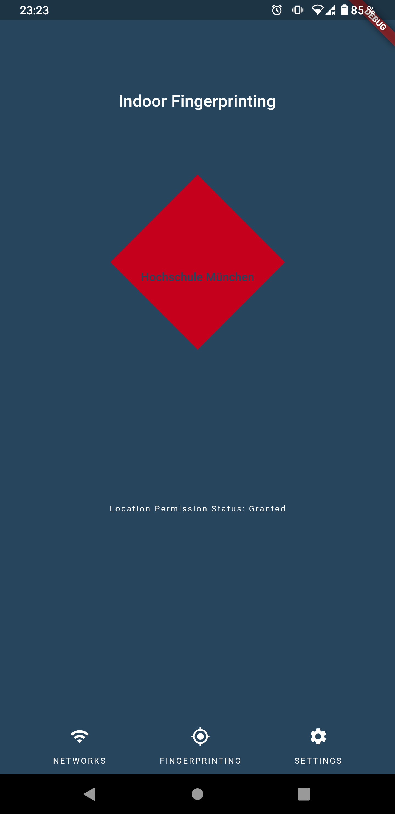
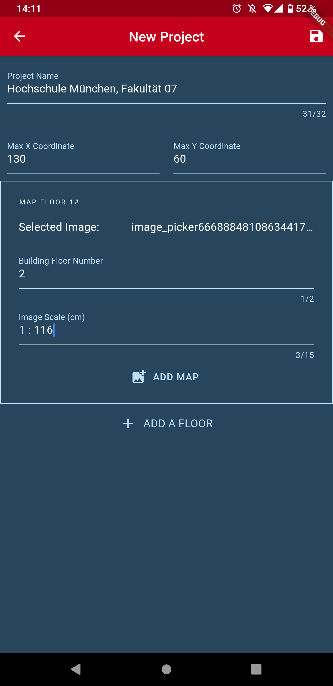
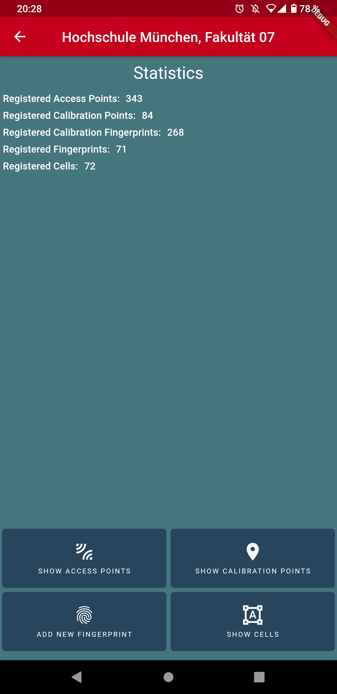
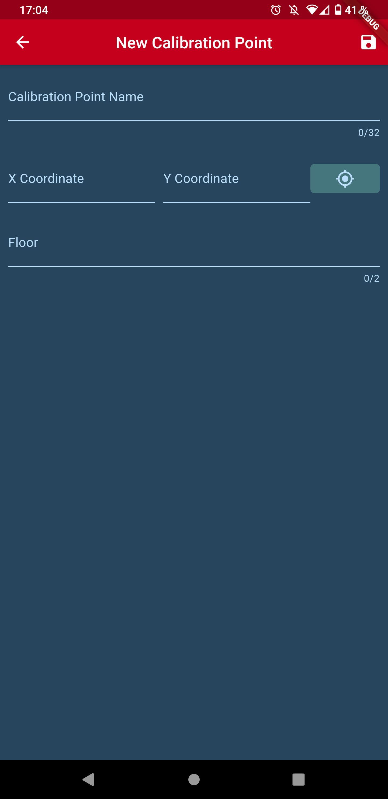
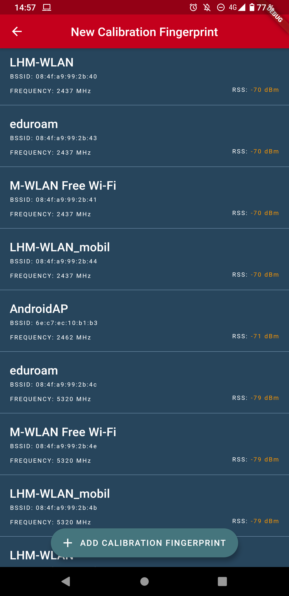
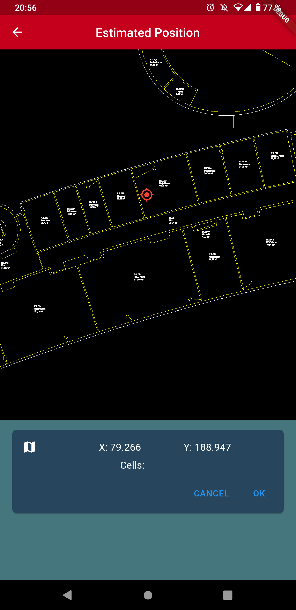

# Wifi Fingerprinting App

Die Wifi Fingerprinting App ist eine mobile Applikation für Android-Geräte zur Positionsbestimmung von Personen in Gebäuden anhand der Empfangsstärken von verschiedenen im Gebäude stationierten WiFi Access Points (AP). 

Das Projekt wurde im Rahmen einer studentischen Arbeit mit Bezug zum Forschungsprojekt NuData Campus am Competence Center Wirtschaftsinformatik (CCWI) der Hochschule München (HM) umgesetzt, und der resultierende Prototyp in einem Gebäude der Hochschule getestet.


## Funktionen

Die Anwendung wurde mittels Flutter-Framework in Dart realisiert und nutzt Dienste des Backend-as-a-Service Firebase von Google LLC. Die Position eines Nutzers wird mit der Fingerprinting-Technik und K-Nearest-Neighbor (KNN)- sowie gewichtetem KNN-Algorithmus berechnet. Dabei werden Fingerprints auf Basis der Received Signal Strength (RSS) aller verfügbaren APs gebildet.

Gebäude müssen in der Anwendung zunächst als Projekte angelegt werden. Ein Gebäude wird dabei mit 1 - 25 Stockwerken sowie maximalen X- und Y-Koordinateneinheiten modelliert. Zudem können Raumpläne der jeweiligen Stockwerke als Bilder hochgeladen werden, welche über die Pixel auf die Koordinaten abgebildet werden.

In der Offline-Phase können Kalibrierungspunkte (KP) angelegt werden, deren Position über die Stockwerksnummer und die X-/Y-Koordinaten festgelegt werden. Hierbei können die Koordinaten auch graphisch über den Raumplan per Zoom-/Pinch-Bewegung referenziert werden. Zu jedem KP sind ein oder mehrere Kalibrierungs-Fingerprints (KFP) hinterlegbar. Ein KFP stellt eine Messung der Radiodaten der verfügbaren APs an einem Kalibrierungspunkt dar. Bei der Erstellung mehrerer KFPs für einen KP wird der Mittelwert der gemessenen Radiodaten für jeden AP gebildet. Die Summe alle Kalibrierungspunkte mit hinterlegten Radiodaten ergibt eine Radiomap.

Die Radiomap kann zudem noch durch Zellen erweitert werden. Eine Zelle ist eine abgegrenzte Fläche innerhalb des Koordinatenraums eines Gebäudes. Mit ihnen ist es möglich, gesonderte Areale wie beispielsweise Räume, auf dem Gebäudeplan gesondert zu kennzeichnen. Befindet sich die Position bei der Lokalisierung innerhalb einer Zelle, wird diese mit angegeben und gespeichert. Neben Name und Stockwerknummer sind mindestens zwei und maximal vier Eckpunkte für die Erstellung einer Zelle erforderlich.

In der Online-Phase sind Fingerprints (FP) anlegbar. Bei einem FP werden die Radiodaten der in Reichweite befindlichen APs gemessen und die geschätzte Position mittels KNN- oder gewichtetem KNN-Algorithmus berechnet. Der Algorithmus sowie der genaue K-Wert kann in den Einstellungen der Anwendung geändert werden. Die berechnete Position wird anschließend visuell auf dem Raumplan angezeigt.

## Screenshots

|  |  |  |
| - | - | - |
|  |  |  |
|  |  |

## Verzeichnisstruktur

|Ordner   | Beschreibung  |
| ------------ | ------------ |
| `/01_cloud_functions/`  |  Quellcode der Firebase Cloud Functions |
| `/02_client/`  |  Quellcode der Flutter Smartphone Applikation |
| `/03_utils/`  |  Externe Tools für Datenbearbeitung |


## Voraussetzungen für die Inbetriebnahme der Applikation
- Installiertes Flutter SDK ([Installationsguide](https://flutter.dev/docs/get-started/install "Installationsguide"))
- Installierte Version von Node 8 oder höher und Node Package Manger (NPM) ([Installer-Download](https://nodejs.org/de/download/ "Installer-Download") | [Windows-Installationsguide](https://docs.microsoft.com/en-us/windows/nodejs/setup-on-windows "Windows-Installationsguide") | [MacOS-Installationsguide](https://www.fosstechnix.com/install-node-js-on-mac/ "MacOS-Installationsguide") | [Linux-Installationsguide](https://ostechnix.com/install-node-js-linux/ "Linux-Installationsguide"))
- Installiertes Android SDK ([Android Studio Installer-Download](https://developer.android.com/studio#downloads "Android Studio Installer-Download") | [Installationsguide für Android-SDK Installation über Android Studio](https://developer.android.com/studio/intro/update#sdk-manager "Installationsguide für Android-SDK Installation über Android Studio"))
- Android Smartphone mit USB-Debugging und ADB-Zugriff aktiviert ODER Android-Emulator ([Installationsguide Android Emulator über Android Studio](https://developer.android.com/studio/run/managing-avds "Installationsguide Android Emulator über Android Studio"))
- Ein Google-Account, verknüpft mit Google's Firebase Plattform (https://firebase.google.com/)
- Ein Google Firebase Projekt für die Android Plattform ([Erstellen und Verküpfen eines Firebase Projekt für die Android Plattform-Videotutorial](https://www.youtube.com/watch?v=DqJ_KjFzL9I#t=01m39s "Erstellen und Verküpfen eines Firebase Projekt für die Android Plattform-Videotutorial"))


## Inbetriebnahme der Flutter Applikation
### Verknüpfen der Anwendung mit Firebase Projekt
1. Einloggen in Firebase Cloud Portal
2. Erstellen eines neuen Projekts anhand diesem [Video Tutorial](https://www.youtube.com/watch?v=DqJ_KjFzL9I#t=01m39s "Video Tutorial") (1:39 - 1:59)
3. Verknüpfen des Projekts mit der Android Anwendung anhand dem [gleichen Video](https://www.youtube.com/watch?v=DqJ_KjFzL9I#t=02m00s "gleichen Video") (2:01 - 2:15), dabei ist es wichtig, dass der Android Package Name identisch mit dem aus dem Projekt ist, also `edu.hm.wifi_fingerprinting`
4. Kopieren der `google-services.json` des Projekts in das Verzeichnis `/02_client/android/app/`


### Starten der Anwendung
1. Starten des Kommandozeilentools  des Betriebssystems
2. Wechseln ins `/02_client/`-Verzeichnis
3. Bei Erstausführung, folgenden Befehl ausführen: `flutter get packages` um fehlende Pakete herzustellen
4. Starten eines Android-Emulators oder Anschließen eines Android Smartphones mit oben genannten Entwicklereinstellungen
5. Ausführen des Befehls `flutter run`, die App sollte bei richtiger vorheriger Konfiguration starten.


### Wechseln der Modi
Zum Wechseln der Betriebs-Modi muss die Zeile 10 in der Datei `/02_client/lib/main.dart` im Code geändert werden:
```dart
configureDependencies('<Modus>'); // <Modus> muss mit Modi-Variable ersetzt werden
```
Modi-Variablen:
`prod` = Positionsberechnung auf Gerät und Datenspeicherung in Firebase Cloud Firestore
`dev` = Positionsberechnung via Cloud Functions und Datenspeicherung in Firebase Cloud Firestore
`local_dev` = Positionsberechnung auf Gerät und Datenspeicherung auf Gerät


## Inbetriebnahme der Firestore Cloud Functions
Bevor die folgenden Schritte ausgeführt werden, sollte die Anwendung zunächst mit einem Firebase Projekt verknüpft sein.

### Installation der Firebase-CLI
1. Starten des Kommandozeilentools  des Betriebssystems
2. Ausführen des Befehls `npm install -g firebase-tools`

### Deployment von Cloud Functions in das Firebase Projekt
[Video-Tutorial](https://www.youtube.com/watch?v=DYfP-UIKxH0#t=07m55s "Video-Tutorial")

1. Starten des Kommandozeilentools des Betriebssystems
2. Wechseln ins `/01_cloud_functions/functions/`-Verzeichnis
3. Bei Erstausführung, folgenden Befehl ausführen: `npm i` um fehlende Pakete herzustellen
4. Ausführen des Befehl `firebase deploy` (Eventuell muss das verknüpfte Projekt ausgewählt werden und/oder ein Login mit Google Konto durchgeführt werden)

## Known Bugs
- `dev`-Modus funktioniert derzeit nicht

## Optimierungspotenziale

Die Anwendung birgt einige Optimierungspotenziale die kurz stichpunktartig dargelegt werden:
- Jedes Speichern von Daten wird über Datenbank-Transaktionen durchgeführt, wodurch zwar ein Datenverlust augeschlossen werden kann, es jedoch auch zu einer stark erhöhten Speicherallokation kommt.
- Die erzeugten Objekte sind der Architektur nach unveränderlich, was bei Transformationen/Kopien von Objekten (bspw. Arrays/Maps mit einer hohen Anzahl an Radiodaten) zu starken Perfomance-Einbußen führt.
- Fehler werden nicht in allen Fällen ausreichend behandelt.
